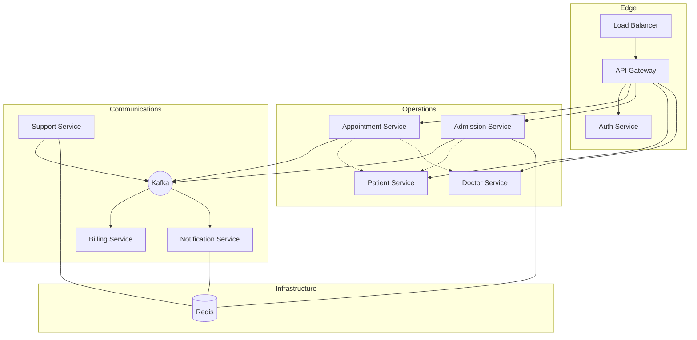

# Hospital Information System (HIS)

> **Project Status: Active Development & Research**
> This repository serves as a technical showcase for implementing distributed systems patterns. It is a hands-on environment where I apply distributed architectures and modern backend stacks to a simulated healthcare domain.

A Hospital Information System (HIS) designed to coordinate clinical and administrative operations across a distributed environment. The project focuses on managing the lifecycle of patient data, medical appointments, and inpatient admissions, ensuring each department has access to the information it needs to deliver care.

## Mission and Objectives

The aim of this project is to model a resilient healthcare platform that handles complex workflows such as:

- **Patient Management**: Centralizing clinical records and provider data.
- **Workflow Orchestration**: Coordinating appointments and hospital admissions.
- **Automated Side-Effects**: Managing financial invoicing and patient notifications as a result of clinical actions.
- **Data Integrity**: Ensuring that data remains consistent and available across different specialized services.

## High-Level Topology



## Tech Stack

- **Core**: Java 22, Spring Boot 3.4
- **Communication**: REST, gRPC, and Apache Kafka
- **Persistence**: PostgreSQL and MongoDB
- **Caching**: Redis
- **Security**: JWT-based stateless authentication
- **Observability**: Prometheus, Grafana, and Micrometer

## Detailed Documentation

For a deep dive into the system design, microservice patterns, and technical specifications, please refer to the official documentation portal:

**[https://doguhanniltextra.github.io/hospital-information-system/](https://doguhanniltextra.github.io/hospital-information-system/)**

## How to Run

The project uses Docker for local orchestration. Ensure you have Docker and Docker Compose installed.

```bash
# Clone the repository
git clone https://github.com/doguhanniltextra/patient-management.git
cd patient-management

# Start services
make dev-up
```

### Access Points

- **API Gateway**: `http://localhost:4004`
- **Swagger Documentation**: `http://localhost:4004/swagger-ui.html`
- **Dashboards**: `http://localhost:3000` (Grafana)

## Feedback and Errors

If you encounter any issues or have suggestions for improvement:

1. Check the **Observability Stack** (Grafana/Prometheus) to identify failing components.
2. Review the **Logs** via the Docker console or the centralized logging platform.
3. Open an issue with the relevant context and any **traceId** associated with the failure.
