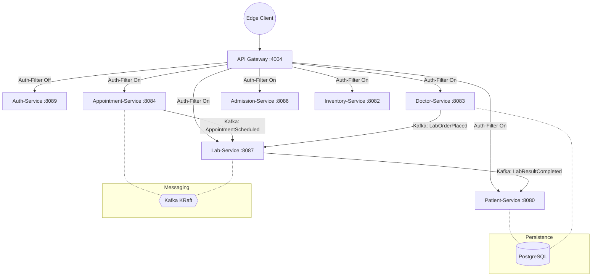

# Hospital Information System (HIS) — Microservices Architecture

This project is a backend system designed for the digital transformation of hospital operations. Built with a distributed, event-driven model, it manages patients, medical staff, clinical workflows, and administrative logistics with a focus on fault tolerance and modularity.

## 🏗️ Architecture

The system consists of independent microservices that communicate via **REST/gRPC** for synchronous operations and **Apache Kafka** for asynchronous event choreography.



## 🛠️ Technology Stack

- **Backend:** Java 17+, Spring Boot 3.x, Spring Cloud Gateway
- **Communication:** REST, gRPC (Protobuf), Apache Kafka (Event-Driven)
- **Data Persistence:** PostgreSQL (Shared cluster / Isolated schemas), MongoDB (Audit logs)
- **Observability:** Prometheus & Grafana
- **Security:** Stateless JWT Authentication (HMAC-SHA256)

## 🚀 Quick Start

The fastest way to get the entire ecosystem running is via the included `Makefile`.

### Prerequisites

- Docker & Docker Compose
- Java 17+ (for building from source)
- Maven (optional, handled by containers)

### Deployment

```bash
# Clone the repository
git clone https://github.com/doguhanniltextra/patient-management.git
cd patient-management

# Start all services and infrastructure
make dev-up
```

Once started:

- **API Gateway:** [http://localhost:4004](http://localhost:4004)
- **Grafana Dashboards:** [http://localhost:3000](http://localhost:3000) (Admin / Admin)
- **Prometheus:** [http://localhost:9090](http://localhost:9090)

_This project is a continuous effort to model complex clinical workflows in a scalable way. Feedback and contributions are always welcome._
