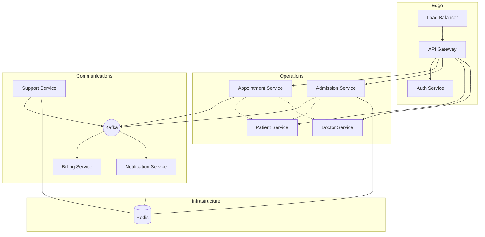

# Hospital Information System (HIS)

> **Project Status: Active Development & Research**
> This repository serves as a technical showcase for implementing distributed systems patterns. It is a hands-on environment where I apply distributed architectures and modern backend stacks to a simulated healthcare domain.

A Hospital Information System (HIS) designed to coordinate clinical and administrative operations across a distributed environment. The project focuses on managing the lifecycle of patient data, medical appointments, and inpatient admissions, ensuring each department has access to the information it needs to deliver care.

## Mission and Objectives

The aim of this project is to model a resilient healthcare platform that handles complex workflows such as:

- **Patient Management**: Centralizing clinical records and provider data.
- **Workflow Orchestration**: Coordinating appointments and hospital admissions.
- **Automated Side-Effects**: Managing financial invoicing and patient notifications as a result of clinical actions.
- **Data Integrity**: Ensuring that data remains consistent and available across different specialized services.

## High-Level Topology



## Tech Stack

- **Core**: Java 22, Spring Boot 3.4
- **Communication**: REST, gRPC, and Apache Kafka
- **Persistence**: PostgreSQL and MongoDB
- **Caching**: Redis
- **Security**: JWT-based stateless authentication
- **Observability**: Prometheus, Grafana, and Micrometer

## Detailed Documentation

For a deep dive into the system design, microservice patterns, and technical specifications, please refer to the official documentation portal:

- **[Documentation](https://doguhanniltextra.github.io/hospital-information-system/)**

## Deep Dives

- [Release v6.2.0 - Distributed System Patterns: CQRS, gRPC, and Saga](https://doguhanniltextra.github.io/portfolio/blog/page/cqrs_grpc_design_patterns.html)
- [Release v1.0.0 - Hospital Information System: Architectural Overview](https://doguhanniltextra.github.io/portfolio/blog/page/his_overview.html)

## How to Run

The project uses Docker for local orchestration. You need Docker Engine/Desktop with Docker Compose v2.
The root `Makefile` is the recommended entry point for running the full stack from the repository root.

```bash
make setup
make up
make smoke
```

What these commands do:

- `make setup` creates missing `.env` files from `.env.example`.
- `make up` starts infrastructure, API Gateway, Auth Service, and all microservices in the right order.
- `make smoke` gets a development JWT and calls `appointment-service` through the API Gateway.

First Docker builds can take a few minutes. Later runs are much faster.

On Windows, use Git Bash/WSL or install GNU Make. If you prefer native PowerShell, each microservice README includes equivalent PowerShell-friendly commands.

Useful commands:

- `make health` checks public actuator health endpoints.
- `make ps` shows container status for every compose file.
- `make logs SERVICE=appointment-service` follows logs for one service.
- `make down` stops containers without deleting database volumes.
- `make reset` stops containers and deletes local volumes.

### Access Points

- **API Gateway**: `http://localhost:4004`
- **Swagger Documentation**: `http://localhost:4004/swagger-ui.html`
- **Dashboards**: `http://localhost:3000` (Grafana)

## Load testing (k6)

Scripts live in `k6-scripts/`. They register a **PATIENT** user in `setup()`, then exercise authenticated reads that match that role (three `GET /api/appointments/doctor-options` calls per iteration with a shared slot: consultation pages 0–1 and vaccination page 0).

With the full stack up (`make up`), run:

```bash
k6 run k6-scripts/low-stress.js
k6 run k6-scripts/medium-stress.js
```

### Benchmark snapshot — `low-stress.js`

Recorded on **2026-05-06** with **k6 v1.7.0**, API Gateway at `http://localhost:4004`, **10 VUs**, **30s**. Gateway limit on `/api/appointments/**` was **30 req/s** replenish / **75** burst (see `api-gateway/src/main/resources/application.yml`).

| Metric | Value |
|--------|------:|
| HTTP requests | 650 |
| Request rate | ~19.4/s |
| Iterations | 216 (~6.45/s) |
| `http_req_duration` avg | ~155 ms |
| `http_req_duration` p(95) | ~586 ms |
| `http_req_failed` | 0% (0 / 650) |
| Check success | 100% |

**Thresholds:** **`rate < 1%` passed** (no **429** from the rate limiter at this load). **`p(95) < 500 ms` did not pass** on this run (~586 ms), driven by occasional slower responses under concurrency—not failed requests.

### Benchmark snapshot — `medium-stress.js`

Same machine and gateway limits as above. Profile: **15s** ramp to **50 VUs**, **30s** at 50, **15s** ramp down (~**60s** staged load). Thresholds in script: **`p(95) < 800 ms`**, **`http_req_failed` &lt; 5%**.

**Scenario:** `setup()` creates **50** distinct **PATIENT** accounts (register + login) with **~350 ms pacing** between auth calls so `/api/auth/**` stays under its own gateway limiter. Each **VU** maps to one user (`(__VU - 1) % 50`) and sends **`X-User-Id`** set to that user’s login name together with that user’s JWT. That matches `RateLimitConfig`: appointments traffic is bucketed **per user**, not one shared **IP** bucket—so **50 × ~30 req/s** appointment throughput can pass without **429** from this filter (aggregate RPS across users can exceed the old single-bucket ceiling).

| Metric | Value |
|--------|------:|
| HTTP requests | 4942 |
| Request rate (avg) | ~45.9/s |
| Iterations | 1614 (~15.0/s) |
| `http_req_duration` avg | ~138 ms |
| `http_req_duration` p(95) | ~319 ms |
| `http_req_failed` | 0% (0 / 4942) |
| Check success | 100% |

**Thresholds:** **`p(95) < 800 ms`** and **`rate < 5%`** **passed** on this run.

**Note:** `X-User-Id` is whatever the client sends; production hardening would derive it from a **verified** JWT (or internal headers) so callers cannot mint arbitrary buckets.

Other profiles: `intense-stress.js`, `appointments-stress.js`, `stress.js`.

## Feedback and Errors

If you encounter any issues or have suggestions for improvement:

1. Check the **Observability Stack** (Grafana/Prometheus) to identify failing components.
2. Review the **Logs** via the Docker console or the centralized logging platform.
3. Open an issue with the relevant context and any **traceId** associated with the failure.
