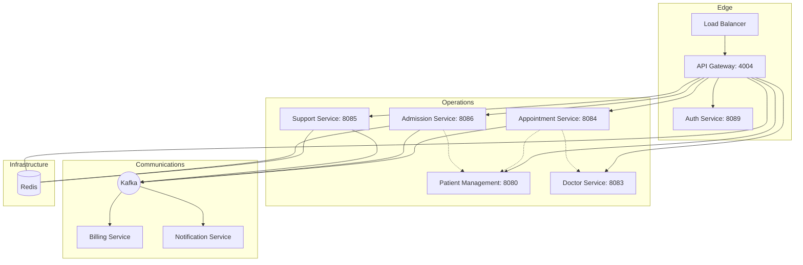

# Hospital Information System (HIS)

> **Project Status: Active Development & Research**  
> This repository serves as a technical showcase for implementing distributed systems patterns. It is a hands-on environment where I apply distributed architectures and modern backend stacks to a simulated healthcare domain.

A Hospital Information System (HIS) designed to coordinate clinical and administrative operations across a distributed environment. The project focuses on managing the lifecycle of patient data, medical appointments, and inpatient admissions, ensuring each department has access to the information it needs to deliver care.

## Mission and Objectives

The aim of this project is to model a resilient healthcare platform that handles complex workflows such as:

- **Patient Management**: Centralizing clinical records and provider data.
- **Workflow Orchestration**: Coordinating appointments and hospital admissions.
- **Automated Side-Effects**: Managing financial invoicing and patient notifications as a result of clinical actions.
- **Data Integrity**: Ensuring that data remains consistent and available across different specialized services.

## High-Level Topology


```mermaid
graph TD
    subgraph Edge
        LB[Load Balancer] --> GW[API Gateway: 4004]
        GW --> Auth[Auth Service: 8089]
    end

    subgraph Operations
        GW --> AS[Appointment Service: 8084]
        GW --> AD[Admission Service: 8086]
        GW --> PS[Patient Management: 8080]
        GW --> DS[Doctor Service: 8083]
        GW --> SS[Support Service: 8085]
    end

    subgraph Communications
        AS --> Kafka((Kafka))
        AD --> Kafka
        SS --> Kafka
        Kafka --> BI[Billing Service]
        Kafka --> NO[Notification Service]
    end

    subgraph Infrastructure
        AS -.-> PS
        AS -.-> DS
        AD -.-> PS
        GW --- Redis[(Redis)]
        SS --- Redis
        AD --- Redis
    end
```

## Tech Stack

- **Core**: Java 21, Spring Boot 3.4
- **Communication**: REST, gRPC (Protobuf), and Apache Kafka
- **Persistence**: PostgreSQL
- **Caching & Rate Limiting**: Redis
- **Security**: JWT-based stateless authentication & RBAC
- **Secret Management**: HashiCorp Vault + External Secrets Operator
- **Observability**: Prometheus, Grafana, and Micrometer
- **Resilience Testing**: Chaos Mesh (CNCF)
- **Container Orchestration**: Kubernetes (Kind Multi-Node: 1 Control-Plane + 2 Workers)
- **CI/CD**: GitHub Actions, Trivy CVE scanning, Kubeconform schema validation

## Deep Dives

- [Release v1.0.0 - Hospital Information System: Architectural Overview](https://doguhanniltextra.github.io/portfolio/blog/page/projects/his_overview.html)
- [Resilience & Chaos Engineering Test Reports](.agent/kind/tests/README.md)

## Services Matrix

| Service | Port | Primary Protocol | Role |
|---|:---:|:---:|---|
| **api-gateway** | `4004` | HTTP / WebSocket | Reverse proxy, rate limiting, and route aggregation |
| **auth-service** | `8089` | HTTP | JWT authentication, user registration, and RBAC |
| **patient-management** | `8080` / `9090` | HTTP / gRPC | Patient records and clinical master data |
| **doctor-service** | `8083` / `9005` | HTTP / gRPC | Staff directories and scheduling slots |
| **appointment-service** | `8084` | HTTP / Kafka | Outpatient booking lifecycle and event dispatching |
| **admission-service** | `8086` | HTTP / Kafka | Inpatient bed management and hospital admissions |
| **support-service** | `8085` | HTTP / Kafka | Lab tests and pharmacy/inventory tracking |
| **billing-service** | — | Kafka Consumer | Automated invoice and claims generation |
| **notification-service** | — | Kafka Consumer | Asynchronous email and SMS dispatching |

## Repository Layout

```text
├── api-gateway/            # Central entry point & rate limiting
├── auth-service/           # Identity, JWT & RBAC
├── patient-management/     # Patient clinical records (REST & gRPC)
├── doctor-service/         # Doctor schedules & staff directory (REST & gRPC)
├── appointment-service/    # Outpatient bookings & Kafka event emitter
├── admission-service/      # Inpatient bed & room management
├── support-service/        # Laboratory & pharmacy orders
├── billing-service/        # Kafka consumer for invoices
├── notification-service/   # Kafka consumer for email/SMS
├── infrastructure/         # Docker Compose configs & database init scripts
├── kubernetes/             # K8s manifests (Kind multi-node, base apps, monitoring)
├── k6-scripts/             # Performance & load testing scenarios
└── .agent/kind/tests/      # Resilience & chaos engineering test reports
```

## Quick Start

### 1. Local Development (Docker Compose)

```bash
# 1. Setup environment file
cp infrastructure/.env.example infrastructure/.env

# 2. Start core infrastructure (PostgreSQL, Redis, Kafka, Vault)
docker compose -f infrastructure/docker-compose.yml up -d

# 3. Build and run any microservice locally
./mvnw clean spring-boot:run -pl auth-service
```

### 2. Multi-Node Kubernetes (Kind)

```bash
# 1. Create Kind cluster (1 Control-Plane + 2 Workers)
kind create cluster --config kubernetes/kind-config.yaml --name his-local

# 2. Deploy monitoring stack (Prometheus & Grafana)
kubectl apply -f kubernetes/platform/monitoring.yaml

# 3. Deploy microservices
kubectl apply -k kubernetes/base/
```

### Access Points

- **API Gateway**: `http://localhost:4004`
- **Auth Endpoint**: `http://localhost:4004/api/auth/login`
- **Grafana Dashboards**: `http://localhost:3000` (`admin` / `admin`)
- **Chaos Mesh Dashboard**: `http://localhost:2333`

## Testing & Quality Assurance

```bash
# Run unit & integration tests across all modules
./mvnw clean test

# Run k6 load test scenarios
k6 run k6-scripts/low-stress.js

# Execute chaos engineering failover tests
python3 .agent/kind/tests/traffic_chaos_test.py
```

## License

This project is licensed under the [MIT License](LICENSE).
