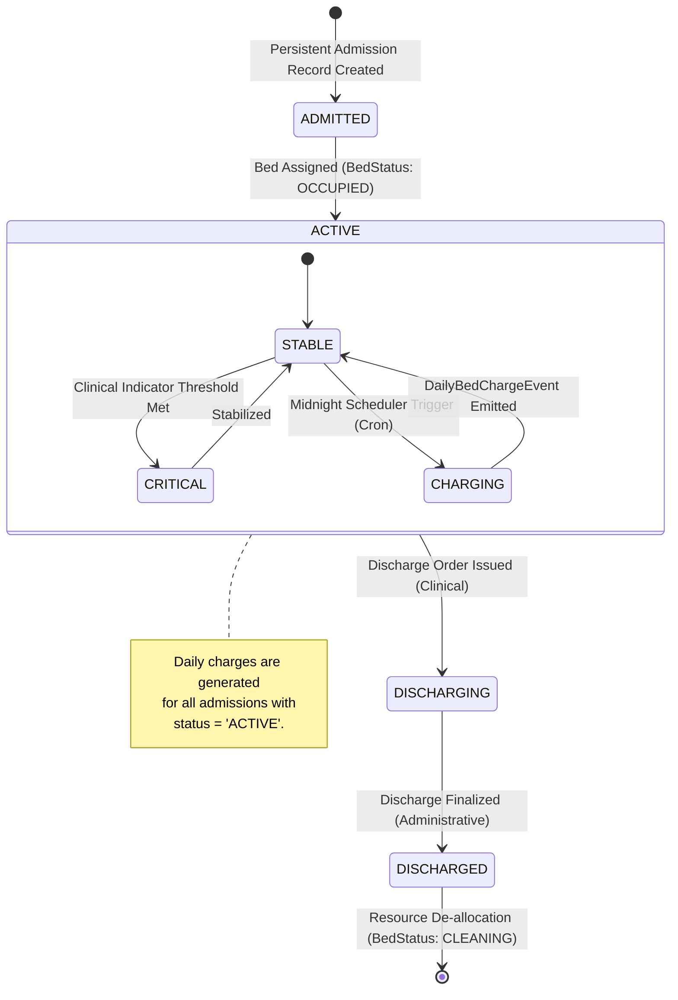
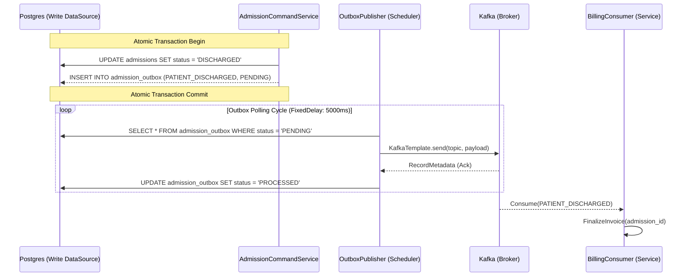

# Admission and Financial Orchestration

The Admission vertical manages the lifecycle of inpatient stay, coordinating between bed utilization, recurring daily charges, and final discharge billing.

## Admission Lifecycle State Machine

A patient's localized state within the hospital environment is managed via the `Admission` aggregate.



## Transactional Outbox Implementation

To ensure eventual consistency between the Admission state and the Billing/Notification services without distributed transactions (2PC), the system implements the **Transactional Outbox Pattern**.

### Outbox Table Schema
| Component | Type | Description |
| :--- | :--- | :--- |
| `id` | UUID | Primary Key / Message Identity |
| `aggregate_id` | String | The ID of the Admission record (surrogate key) |
| `event_type` | String | e.g., `PATIENT_DISCHARGED`, `DAILY_BED_CHARGE` |
| `payload` | TEXT (JSON) | Protobuf-derived JSON payload |
| `status` | Enum | PENDING, PROCESSED, FAILED |
| `retry_count` | INT | Backoff tracking for Kafka publisher failures |

### Publication Flow


## Idempotency Tracking

To mitigate the effects of Kafka's "at-least-once" delivery semantics, all downstream consumers (Billing, Notification) utilize a **Processed Message Store**.

### Implementation Strategy
Before executing a state change (e.g., generating an invoice), the consumer performs an existence check:
```java
if (processedEventRepository.existsByMessageId(messageId)) {
    log.info("Duplicate message detected: {}. Skipping.", messageId);
    return;
}
// Proceed with processing...
processedEventRepository.save(new ProcessedEvent(messageId));
```
- **Storage**: The `processed_events` table in the consumer's local schema.
- **Cleanup**: Messages older than 7 days are automatically purged via a background purge job to maintain index performance.
