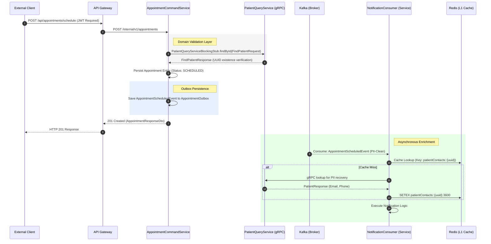

# Appointment Lifecycle Specification

The appointment scheduling process is an orchestrated distributed transaction that enforces data integrity across the Patient, Doctor, and Appointment domains.

## Synchronous Validation and Persistence Sequence

The following sequence diagram details the interaction between internal service components, gRPC stubs, and the Kafka producer lifecycle.

## Implementation Details

### 1. Data Transfer Objects (DTOs)
- **Request**: `AppointmentRequestDto` containing `patientId`, `doctorId`, and `appointmentDate`.
- **gRPC Message**: `FindPatientRequest` (Protobuf-encoded) used for low-latency validation against the Patient Master Data service.
- **Kafka Payload**: `AppointmentScheduledEvent`. This object is strictly sanitized; it contains surrogate identifiers and lacks any patient-identifiable markers (PII).

### 2. Transactional Integrity
The Appointment Service employs a local transaction boundary that includes:
1.  State transition in the primary `appointments` table.
2.  Insertion into the `appointment_outbox` table.

A dedicated `AppointmentOutboxPublisher` polls the outbox table to ensure at-least-once delivery to the `appointment-scheduled.v1` topic, decoupling the database commit from the Kafka network availability.

### 3. Concurrency and Race Conditions
Validations via gRPC are performed within the request-response thread. The system relies on Postgres default isolation levels (Read Committed) and gRPC timeouts (default 2s) to maintain throughput while preventing cascading failures during high load.
