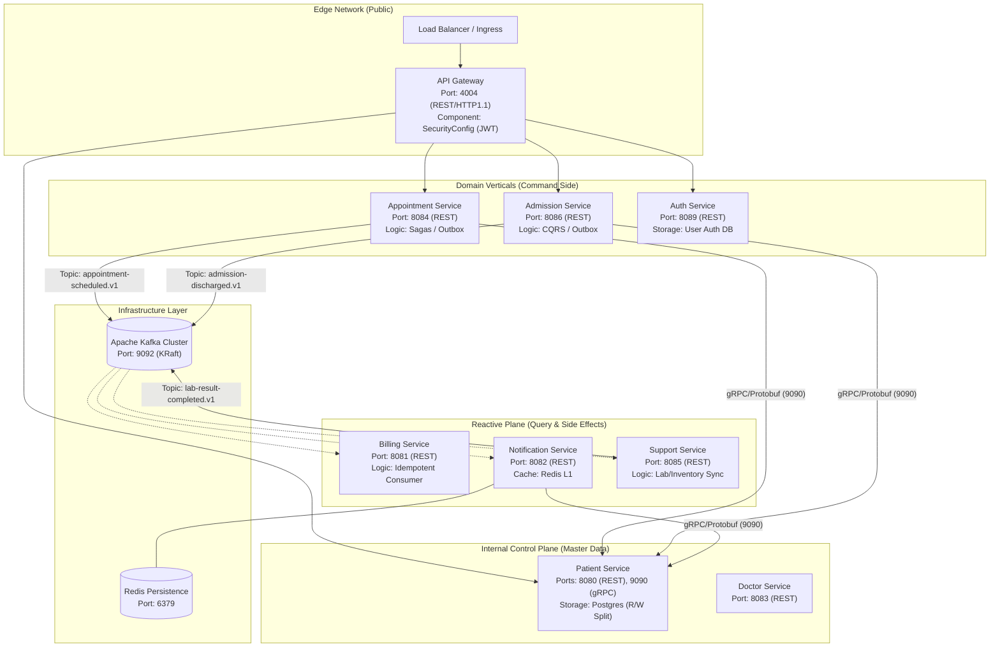

# System Topology and Network Architecture

The HIS architecture utilizes a distributed microservices model with a bifurcated communication strategy. Data integrity is maintained via synchronous gRPC calls for state validation, while scalability is addressed through asynchronous event choreography via Apache Kafka.

## Component Landscape

The following diagram maps the logical network boundaries, internal service ports, and data flow directions.

## Protocol Specifications

### 1. gRPC (Internal Synchronous Communication)
Internal lookups for patient master data and doctor availability bypass the REST gateway and communicate directly via gRPC over HTTP/2.
- **Serialization**: Protocol Buffers (proto3)
- **Service Interfaces**: `PatientQueryService.proto`, `DoctorQueryService.proto`
- **Interactions**: Unary Requests for validation; Client/Server streaming for bulk health data transfers.

### 2. Apache Kafka (Event Choreography)
The system employs a decentralized event-driven model to ensure loose coupling.
- **Topology**: KRaft-based cluster (no Zookeeper).
- **Semantics**: At-least-once delivery with consumer-side idempotency tracking.
- **Data Privacy**: Message payloads are **PII-Clean**. All sensitive attributes (Email, Phone, PII) are replaced with surrogate keys (UUIDs), requiring enrichment via gRPC fallback in downstream consumers.

### 3. Database Strategy
- **Master Data**: `patient-management` uses a Read/Write splitting pattern with dedicated data sources to optimize for read-heavy gRPC lookups.
- **Transactional Outbox**: Command-side services (Admission, Appointment) implement the Outbox pattern in Postgres to ensure atomic state updates and event publishing.

## Build Architecture and Dependency Strategy

The system has transitioned from a centralized inheritance model to an **Independent Build Lifecycle** strategy.

### 1. Dependency Decoupling
- **Removal of BOM**: The `patient-management-bom` has been eliminated to prevent dependency version collisions and allow services to upgrade libraries (e.g., Spring Boot, gRPC) at different velocities.
- **Direct Parentage**: Every microservice now inherits directly from `spring-boot-starter-parent`, ensuring they have full control over their runtime configuration.

### 2. Standardization via Infrastructure
- **Common Libraries**: Cross-cutting concerns (Lombok, Jackson, Protobuf) are managed via explicit, service-local version properties to maintain build hermeticity.
- **Protocol Consistency**: While builds are independent, the API contracts (Protobuf definitions) remain the "source of truth," ensuring that decoupled services remain compatible over gRPC.

